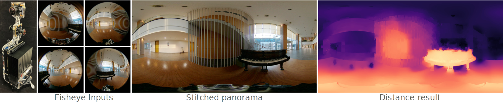

# Real-Time Sphere Sweeping Stereo from Multiview Fisheye Images

### [Project page](http://vclab.kaist.ac.kr/cvpr2021p1/) | [Paper](http://vclab.kaist.ac.kr/cvpr2021p1/cvpr21-sphere-sweeping.pdf) | [Presentation](https://www.youtube.com/watch?v=MvHa6b2TMus) | [Dataset](http://vclab.kaist.ac.kr/cvpr2021p1/evaluation_dataset.zip)
[Andreas Meuleman](https://ameuleman.github.io), 
[Hyeonjoong Jang](http://vclab.kaist.ac.kr/hjjang/), 
[Daniel S. Jeon](https://edoli.github.io/research/), 
[Min H. Kim](http://vclab.kaist.ac.kr/minhkim/)<br>
KAIST<br>
Visual Computing Lab., School of Computing

Here we provide a python implementation of our sphere sweeping stereo algorithm presented at IEEE CVPR 2021 as oral: **Real-Time Sphere Sweeping Stereo from Multiview Fisheye Images**. 


The leftmost photograph shows our prototype that includes four fisheye cameras equipped with Sony IMX477 sensors and an embedded computer with a mobile GPU (an NVIDIA Jetson AGX Xavier). The four 1216 × 1216 px fisheye images at the second column present input images. The following images show a 360° stitched panorama and a corresponding distance map of 2048 × 1024 pixels. This code includes some CUDA-based GPU acceleration so that a CUDA-enabled GPU is required.

Note that this open-source implementation is released for validating the reproducibility of the proposed algorithm. This version shows additional overhead from python libraries, preventing real-time performance (producing a 360 panorama and distance map in 34 ms on the mobile device). If you are interested in licensing the real-time version of our algorithm, please contact [Min H. Kim](mailto:minhkim@kaist.ac.kr) by email.

## Setup
```
git clone https://github.com/KAIST-VCLAB/sphere-stereo.git
cd sphere-stereo
conda env create -f environment.yml
conda activate sphere-stereo
conda install pytorch cudatoolkit=11.1 -c pytorch -y
```

## Demo
We provide a minimal dataset in `resources/`. To run our algorithm:
```
python python/main.py --dataset_path resources --references_indices 2 3  --visualize True
```
The RGB-D panoramas are saved in `<dataset_path>/output/` as `rgb_<index>.png` for the colour and as float for the distance maps `inv_distance_<index>.exr`.

## Evaluation dataset
To download and run evaluation on our rendered dataset, run:
```
wget http://vclab.kaist.ac.kr/cvpr2021p1/evaluation_dataset.zip
unzip evaluation_dataset.zip
python python/main.py --dataset_path evaluation_dataset --references_indices 0 2 --evaluate True
```

## Parameters
* `--dataset_path` 
* `--references_indices` Indices of the cameras where distance estimation is performed before stitching. Reference cameras should together cover the entire field of view. Typically, increasing the number of reference cameras improves the RGB-D panorama quality at a higher computational cost.
* `--min_dist`, `--max_dist` Radii of the closest and farthest spheres for sphere sweeping volume computation (default: 0.55 and 100)
* `--candidate_count` Number of distance candidates for sphere sweeping volume computation. Distance estimation with a wider baseline or higher resolution typically benefits from a higher number of candidates (default: 32).
* `--sigma_i` Edge preservation parameter. Lower values preserve edges during cost volume filtering. 10 is usually appropriate.
* `--sigma_s` Smoothing parameter. Higher values give more weight to coarser scales during filtering. We use 25 when `matching_resolution` is set to [1024, 1024]. This value should be scaled proportionally to the `matching_resolution`.
* `--matching_resolution` Resolution used for fisheye depth estimation. Higher resolutions give better results at a higher computational cost. It is set to [1024, 1024] for our prototype.
* `--rgb_to_stitch_resolution` Resolution of the fisheye images to stitch. As a higher resolution does not impact runtime meaningfully, it can be set as the input resolution [1216, 1216] in our prototype.
* `--panorama_resolution` Resolution of the output RGB-D panoramas (default: [2024, 1024]). 
* `--device` CUDA-enabled GPU used for processing (default: `"cuda:0"`).
* `--saving` Save the RGB-D panoramas in `<dataset_path>/output/` (default: `True`).
* `--visualize` Display each output RGB-D panorama and hang processing (default: `False`).
* `--evaluate` Runs evaluation by reading ground truth in `<dataset_path>/gt/`. Prints the average colour PSNR and SSIM as well as the inverse distance MAE, RMSE and bad pixel ratios (default: `False`).
* `--bad_px_ratio_thresholds` List of thresholds for bad pixel ratio evaluation. The bad pixel ratio corresponds to the proportion of pixels with an error above the threshold (default: [0.1, 0.4]). 

## Other datasets
When running on a custom dataset, we must take the following considerations into account:
* For calibration, we use [basalt](https://gitlab.com/VladyslavUsenko/basalt/-/blob/master/doc/Calibration.md)'s format with the [Double Sphere Camera Model](https://arxiv.org/abs/1807.08957).
* The viewpoint for the output panorama is at the center of the reference cameras.
* The dataset folder should follow the following layouts:
    ```
    <dataset_path>
    ├── cam0 
    │   ├── <first image name>.<ext>
    │   ├── <second image name>.<ext>
    │   ├── ...
    │   ├── mask.png
    ├── cam1
    │   ├── ...
    ├── ...
    ├── gt
    │   ├── rgb_<first image name>.png
    │   ├── inv_distance_<second image name>.exr
    │   ├── ...
    └── calibration.json
    ```
    Masks are optional. The format of input fisheye images should be compatible with OpenCV and `uint8`, `uint16` or `float32`.

## License
Andreas Meuleman and Min H. Kim have developed this software and related documentation (the "Software"); confidential use in source form of the Software, without modification, is permitted provided that the following conditions are met:

Neither the name of the copyright holder nor the names of any contributors may be used to endorse or promote products derived from the Software without specific prior written permission.

The use of the software is for Non-Commercial Purposes only. As used in this Agreement, “Non-Commercial Purpose” means for the purpose of education or research in a non-commercial organization only. “Non-Commercial Purpose” excludes, without limitation, any use of the Software for, as part of, or in any way in connection with a product (including software) or service which is sold, offered for sale, licensed, leased, published, loaned or rented. If you require a license for a use excluded by this agreement, please email [minhkim@kaist.ac.kr].

Warranty: KAIST-VCLAB MAKES NO REPRESENTATIONS OR WARRANTIES ABOUT THE SUITABILITY OF THE SOFTWARE, EITHER EXPRESS OR IMPLIED, INCLUDING BUT NOT LIMITED TO THE IMPLIED WARRANTIES OF MERCHANTABILITY, FITNESS FOR A PARTICULAR PURPOSE, OR NON-INFRINGEMENT. KAIST-VCLAB SHALL NOT BE LIABLE FOR ANY DAMAGES SUFFERED BY LICENSEE AS A RESULT OF USING, MODIFYING OR DISTRIBUTING THIS SOFTWARE OR ITS DERIVATIVES.

Please refer to license.txt for more details.

## Citation
```
@InProceedings{Meuleman_2021_CVPR,
    author = {Andreas Meuleman and Hyeonjoong Jang and Daniel S. Jeon and Min H. Kim},
    title = {Real-Time Sphere Sweeping Stereo from Multiview Fisheye Images},
    booktitle = {CVPR},
    month = {June},
    year = {2021}
}
```
